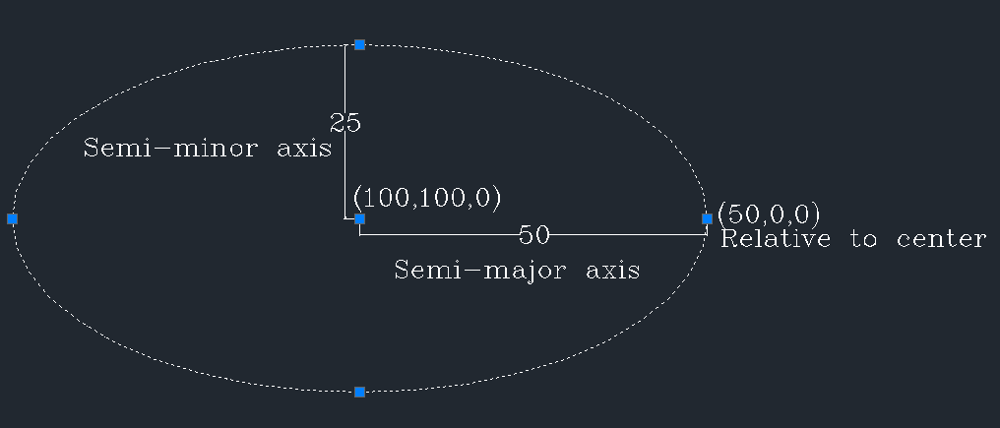

# Entities

Entities are the graphical objects in dxf.

:::info

All entities described here are added directly to the model space block.

:::

All Entities have some common options:

- `trueColor`
- `colorNumber`
- `layerName`
- `visible`
- `lineType`
- `lineTypeScale`

## `ARC` entity

An arc is a portion of the circumference of a circle.
(See more in [Wikipedia](https://en.wikipedia.org/wiki/Circular_arc))

```js
import DxfWriter, { point3d, addArc } from "@tarikjabiri/dxf";

const dxf = new DxfWriter();

dxf.addArc(point3d(0, 0, 0), 10, 0, 45);
// or
const myArc = addArc(point3d(0, 0, 0), 10, 0, 45); // If you want a reference to the added arc.
```

## `CIRCLE` entity

A circle is a shape consisting of all points in a plane that are at a given distance from a given point, the centre.
Equivalently, it is the curve traced out by a point that moves in a plane so that its distance from a given point is constant.
The distance between any point of the circle and the centre is called the radius. (From [Wikipedia](https://en.wikipedia.org/wiki/Circle))

```js
import DxfWriter, { point3d, addCircle } from "@tarikjabiri/dxf";

const dxf = new DxfWriter();

dxf.addCircle(point3d(0, 0, 0), 10);
// or
const myCircle = addCircle(point3d(0, 0, 0), 10); // If you want a reference to the added circle.
```

## `ELLIPSE` entity

An ellipse is a plane curve surrounding two focal points, such that for all points on the curve, the sum of the two distances to the focal points is a constant.
As such, it generalizes a circle, which is the special type of ellipse in which the two focal points are the same.
(From [Wikipedia](https://en.wikipedia.org/wiki/Ellipse))

```js
import DxfWriter, { point3d, addEllipse } from "@tarikjabiri/dxf";

const dxf = new DxfWriter();

dxf.addEllipse(point3d(100, 100, 0), point3d(50, 0, 0), 0.5, 0, 2 * Math.PI);

// or if you want a reference to the added ellipse.
const myEllipse = addEllipse(
  point3d(100, 100, 0),
  point3d(50, 0, 0),
  0.5,
  0,
  2 * Math.PI
);
```



## `3DFACE` entity

A 3d face is flat surface with 4 corners.

```js
import DxfWriter, { point3d, add3dFace } from "@tarikjabiri/dxf";

const dxf = new DxfWriter();

dxf.add3dFace(
  point3d(0, 0, 0),
  point3d(0, 100, 0),
  point3d(100, 100, 0),
  point3d(100, 0, 0)
);

// or if you want a reference to the added face.
const my3dFace = add3dFace(
  point3d(0, 0, 0),
  point3d(0, 100, 0),
  point3d(100, 100, 0),
  point3d(100, 0, 0)
);
```

You can contole the visibilty of the edges of the 3d Face by using the convenience methods:

```js
my3dFace.setFirstEdgeVisible(true);
my3dFace.setSecondEdgeVisible(true);
my3dFace.setThirdEdgeVisible(true);
my3dFace.setFourthEdgeVisible(true);

//Or all of them at once
my3dFace.setEdgesVisible(true);
```

> By default all of them are visible.

Also you can set the visibilty in the options:

```js
import DxfWriter, {
  point3d,
  add3dFace,
  InvisibleEdgeFlags,
} from "@tarikjabiri/dxf";

const dxf = new DxfWriter();

dxf.add3dFace(
  point3d(0, 0, 0),
  point3d(0, 100, 0),
  point3d(100, 100, 0),
  point3d(100, 0, 0),
  {
    invisibleEdges: InvisibleEdgeFlags.First | InvisibleEdgeFlags.Fourth,
  }
);
// This will make the first and fourth edges invisible.
```

:::tip

To define a 3d face with only 3 corners, make the fourth same as the third corner 😉.

:::

## `HATCH` entity

The HATCH entity fills an enclosed area defined by one or more boundary paths with a hatch pattern : solid or gradient.

To create a hatch you need to define :

- A boundary path or multiple.
  - Polyline path is the simple way
  - Edges path is the flexible way
- A hatch pattern solid or gradient.

Define a polyline path :

```js
import { HatchPolylineBoundary, vertex } from "@tarikjabiri/dxf";

const polyline = new HatchPolylineBoundary();
polyline.add(vertex(0, 0));
polyline.add(vertex(0, 10000));
polyline.add(vertex(10000, 10000));
polyline.add(vertex(10000, 0));
// You can define a bulge for the vertex also
polyline.add(vertex(10000, 0, 10));
```

Define a edges path :

```js
import { HatchEdgesTypeData, point2d } from "@tarikjabiri/dxf";

const edges = new HatchEdgesTypeData();
edges.addLineEdgeData(point2d(0, 0), point2d(0, 10000));
edges.addLineEdgeData(point2d(0, 10000), point2d(10000, 10000));
edges.addLineEdgeData(point2d(10000, 10000), point2d(10000, 0));
edges.addLineEdgeData(point2d(10000, 0), point2d(0, 0));
// For now LineEdge and ArcEdge are supported
```

Create a `HatchBoundaryPath` instance :

```js
import { HatchBoundaryPath } from "@tarikjabiri/dxf";

const boundary = new HatchBoundaryPath();

// Add the defined path
boundary.addPolylineBoundary(polyline); // You can add multiple
// Or
boundary.addEdgesTypeData(edges); // You can add multiple
```

:::warning
You can define one type of paths `HatchPolylineBoundary` or `HatchEdgesTypeData`, not both at same time.
:::

Next you define the fill pattern solid or gradient :

```js
import { pattern, gradient, GradientType } from "@tarikjabiri/dxf";
// Solid
const mysolid = pattern({
  name: HatchPredefinedPatterns.STEEL,
  // Other properties you can define optionally
  // angle?: number;
  // scale?: number;
  // double?: boolean;
});

// Gradient
const mygradient = gradient({
  firstColor: 5,
  type: GradientType.CYLINDER,
  // Other properties you can define optionally
  // secondColor?: number;
  // angle?: number;
  // definition?: number;
  // tint?: number;
});
```

Now you have a boundary path and a fill pattern, you can add the hatch :

```js
import DxfWriter, { addHatch } from "@tarikjabiri/dxf";

const dxf = new DxfWriter();

// You can call addHatch from dxf object
dxf.addHatch(boundary, mygradient);

// Or call directly addHatch to store a reference to the hatch object
const hatch = addHatch(boundary, mygradient);
```

:::info
This way you can add only non-associative hatches.
:::

## `IMAGE` entity

```js
import DxfWriter, { point3d, addImage } from "@tarikjabiri/dxf";

const dxf = new DxfWriter();

dxf.addImage(
  ".\\image-name.png", // Or the absolute path of the image if it isn't int the same folder.
  "image-name",
  point3d(462419.04, 576568.45, 0), // Insertion point of the bottomLeft corner of the image.
  1792, // the width of the image
  1280, // the height of the image
  1, // Scale
  0 // rotation
);
```

If you want a reference to the added image use `addImage()`.

## `INSERT` entity

It's convenient to create reusable blocks at once and use them all over the places you want.
After defining your blocks, you can insert them with the `INSERT` entity. See example code below:

```js
import DxfWriter, { point3d, addInsert } from "@tarikjabiri/dxf";

const dxf = new DxfWriter();

// Define your block
const myBlock = addBlock("block1");
myBlock.addCircle(point3d(0, 0, 0), 50);
myBlock.addRectangle(point2d(-35.3553, 35.3553), point2d(35.3553, -35.3553));

// Insert it when and where ever you want.
dxf.addInsert(myBlock.name, point3d(0, 0, 0));
// Or if you want a reference to the added insert.
const myInsert = addInsert(myBlock.name, point3d(0, 0, 0));
```

## `LINE` entity

```js
import DxfWriter, { point3d, addLine } from "@tarikjabiri/dxf";

const dxf = new DxfWriter();

dxf.addLine(point3d(0, 0, 0), point3d(100, 100, 0));
// Or if you want a reference to the added line.
const line = addLine(point3d(0, 0, 0), point3d(100, 100, 0));
```

## `LWPOLYLINE` entity

```js
import DxfWriter, { point3d, addLine } from "@tarikjabiri/dxf";

const dxf = new DxfWriter();

const vertices = [
  {
    point: point2d(0, 0, 0),
  },
  {
    point: point2d(100, 100, 0),
  },
  {
    point: point2d(100, 200, 0),
  },
  {
    point: point2d(0, 300, 0),
  },
];

dxf.addLWPolyline(vertices, {
  flags: LWPolylineFlags.Closed,
});

// Or if you want a reference to the added lwpolyline.
const lwpolyline = addLWPolyline(vertices);
```

## `POINT` entity

```js
import DxfWriter, { point3d, addPoint } from "@tarikjabiri/dxf";

const dxf = new DxfWriter();

dxf.addLine(point3d(0, 0, 0), point3d(100, 100, 0));
// Or if you want a reference to the added line.
const line = addLine(point3d(0, 0, 0), point3d(100, 100, 0));
```

## `POLYLINE` entity

## `SPLINE` entity

## `TEXT` entity
