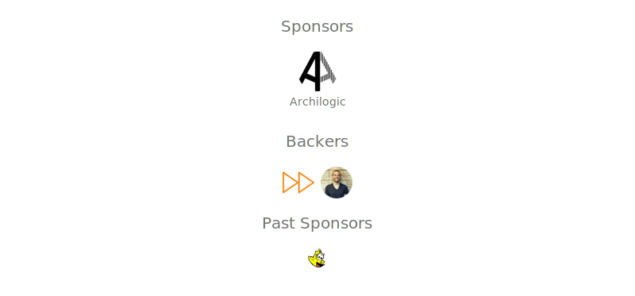

<VPTeamPageSection>
  <template #title>Maintainers, Sponsors & Contributors</template>
  <template #members>
    <VPTeamMembers size="small" :members="members" />
  </template>
</VPTeamPageSection>

 

 

